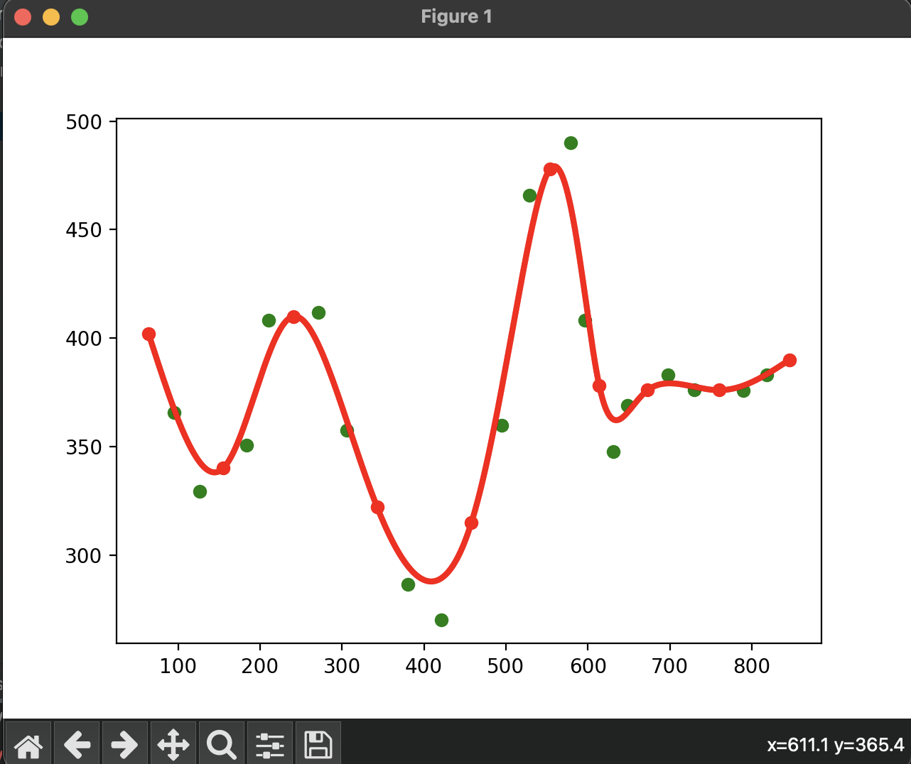
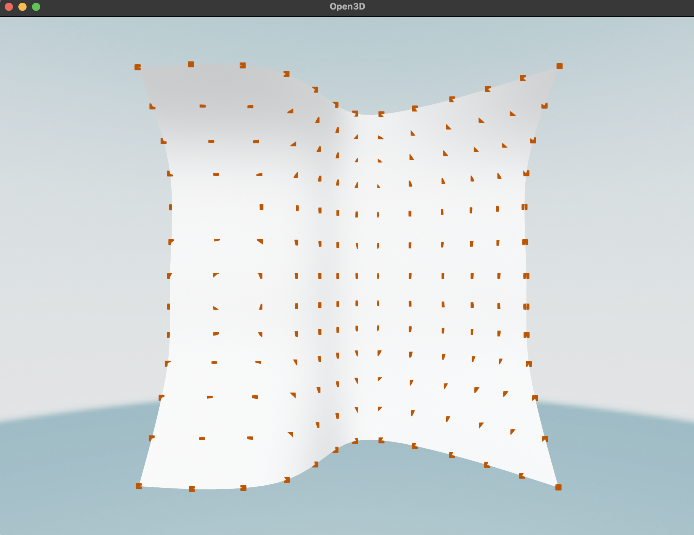
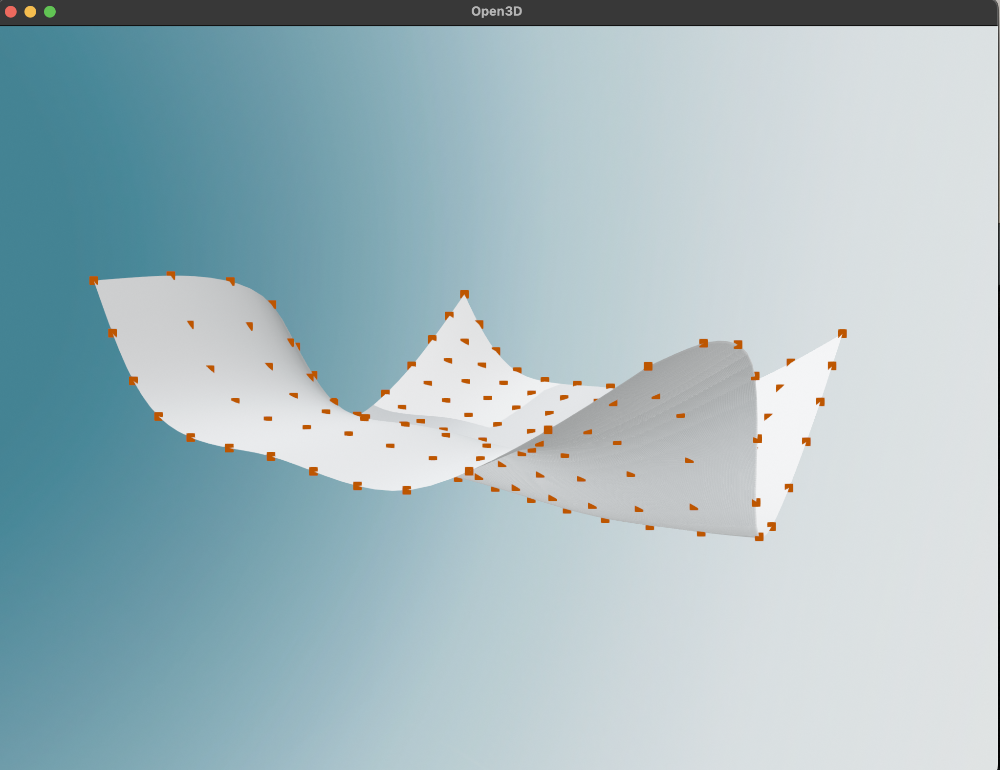
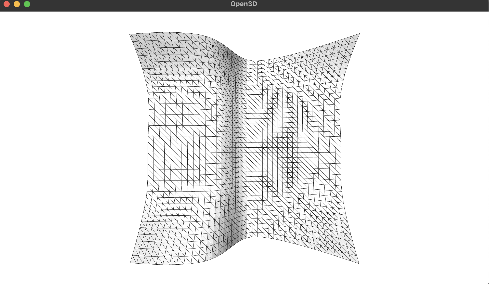
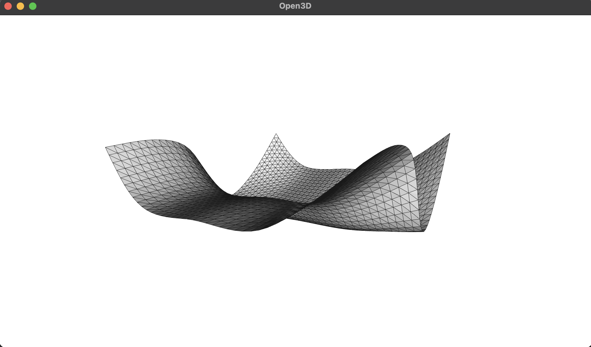

# MOOG-Module

Варіант № 15

## 1. Побудувати сплайн Безьє.
\* Для знаходження контрольних точок використала м-д описаний в файлі borisen.pdf
Результат (зеленим відмічені контрольні точки):

  

## 2. Побудувати поверхню NURBS
Візуалізація 1(вхідні точки відмічені помаранчевим):

  
  

Візуалізація 2(з відображенням wireframe'у, кінцевих точок в 3 рази більше):

  
  

